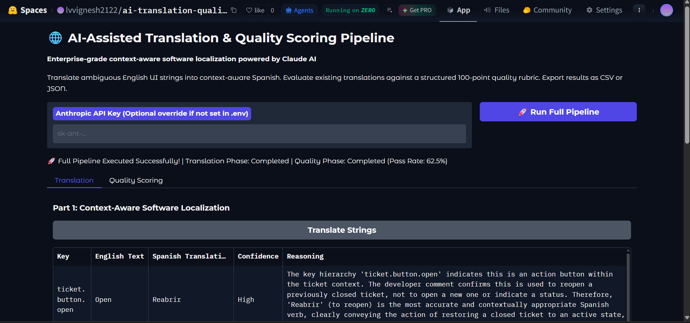
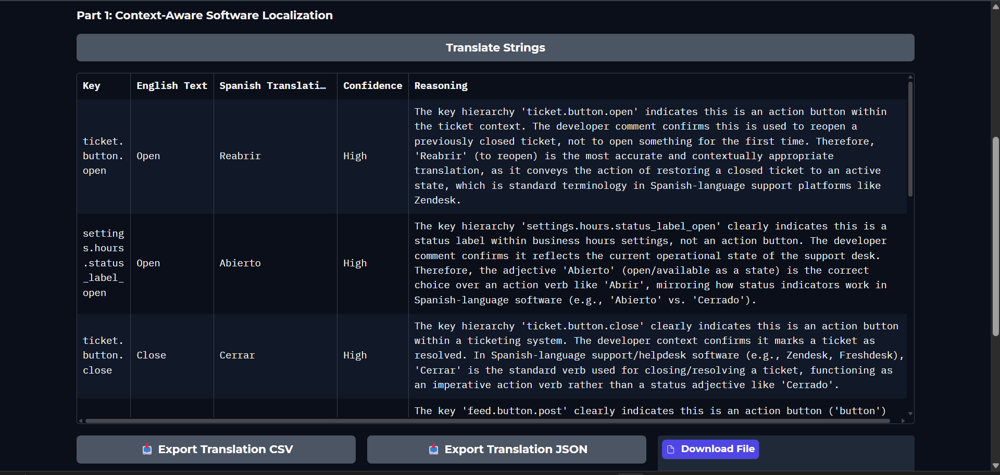
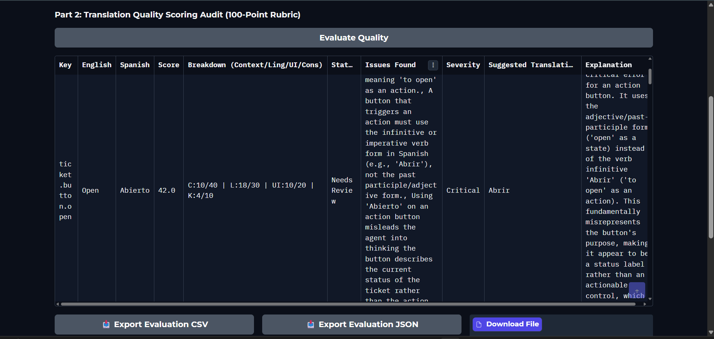

# 🌐 AI-Assisted Translation & Quality Scoring Pipeline

[](https://www.python.org/downloads/)
[](https://docs.anthropic.com/)
[](https://gradio.app/)
[](https://huggingface.co/spaces/lvvignesh2122/ai-translation-quality-pipeline)
[](LICENSE)

An enterprise-grade AI software localization and translation quality evaluation system. This project demonstrates how Large Language Models perform context-aware software internationalization (i18n) and objective, explainable translation quality auditing through a clean reviewer-friendly Gradio interface.


---

## 🚀 Live Demo

**▶️ Try it on Hugging Face Spaces:**  
👉 [https://huggingface.co/spaces/lvvignesh2122/ai-translation-quality-pipeline](https://huggingface.co/spaces/lvvignesh2122/ai-translation-quality-pipeline)

> Bring your own Anthropic API key — enter it directly in the UI input field (it is never stored).

---

## 📸 Application Preview

### 🖥️ Dashboard



### 🌍 Context-Aware Translation



### 📊 Quality Scoring Audit


---

## 📌 Project Overview

Software localization requires more than literal dictionary translations. English software UI strings frequently contain polysemous single words — such as **"Open"**, **"Post"**, or **"Due"** — whose correct translation changes dramatically depending on user context and developer intent.

This project solves software localization challenges through two independent, production-grade pipelines:

1. **Context-Aware Software Localization** — Translates ambiguous English UI strings into Spanish by analyzing string key hierarchy and developer comments alongside the source text.
2. **Translation Quality Scoring Audit** — Evaluates candidate translations using an explainable 100-point scoring rubric, producing itemized issue reports, severity ratings, and suggested corrections.
3. **Interactive Reviewer Interface** — Features a clean Gradio dashboard allowing engineering teams to run pipelines independently or end-to-end, with exportable CSV and JSON reports.

---

## 🛠️ Tech Stack

| Layer | Technology |
|---|---|
| **LLM Engine** | Anthropic Claude API (`claude-sonnet-4-6`) |
| **User Interface** | Gradio 5 (Soft theme) |
| **Core Runtime** | Python 3.11+ |
| **Data Validation** | Pydantic v2 |
| **Data & Exports** | Pandas, JSON, CSV |
| **Environment** | python-dotenv |
| **Deployment** | Hugging Face Spaces (Zero GPU / CPU) |

---

## 🏗️ Architecture

```
                 ┌──────────────────────────────────────┐
                 │         Gradio User Interface        │
                 │              (app.py)                │
                 └──────────────────┬───────────────────┘
                                    │ orchestrates only
               ┌────────────────────┴───────────────────┐
               ▼                                        ▼
     ┌───────────────────┐                    ┌───────────────────┐
     │   translator.py   │                    │     scorer.py     │
     │ Context-Aware     │                    │ 100-Point Quality │
     │ Localization      │                    │ Scoring Audit     │
     └─────────┬─────────┘                    └─────────┬─────────┘
               │                                        │
               └────────────────────┬───────────────────┘
                                    ▼
                        ┌───────────────────────┐
                        │    claude_client.py   │
                        │  Retry · Backoff      │
                        │  JSON parsing         │
                        └───────────┬───────────┘
                                    ▼
                        ┌───────────────────────┐
                        │  Anthropic Claude API │
                        │  (claude-sonnet-4-6)  │
                        └───────────────────────┘
```

**Design Principles:**
- `app.py` contains **zero business logic** — orchestration only
- `translator.py` and `scorer.py` **never call the API directly**
- All LLM interactions are routed through `claude_client.py`
- All data contracts enforced by `schemas.py` Pydantic models

---

## 📂 Repository Structure

```
ai-translation-quality-pipeline/
├── app.py              # Gradio UI & orchestration layer
├── claude_client.py    # Anthropic Claude API client (retries, timeouts, JSON parsing)
├── translator.py       # Context-aware translation service
├── scorer.py           # 100-point rubric quality scoring & metrics aggregator
├── prompts.py          # Structured system & user prompts
├── schemas.py          # Strict Pydantic models for data validation
├── sample_data.py      # Benchmark datasets (10 translation + 8 evaluation pairs)
├── config.py           # Configuration management (.env & environment resolution)
├── logger.py           # Standardized application logging
├── utils.py            # DataFrame conversion & CSV/JSON export helpers
├── requirements.txt    # Dependency manifest
├── .env.example        # Environment configuration template
└── README.md           # This file
```

---

## 💡 Context-Aware Translation Strategy

### How Claude Resolves Polysemy
Every localization request provides Claude with three contextual signals:

1. **UI Key Syntax** — e.g., `ticket.button.open` vs `settings.hours.status_label_open`
2. **Developer Commentary** — e.g., *"Button an agent clicks to open a closed support ticket back up"*
3. **English Source Text** — e.g., *"Open"*

Claude combines these signals to infer whether a string represents an action verb, a status adjective, or a specific domain concept before selecting the correct Spanish term.

### Polysemy Benchmark

| English | UI Key | Context | Naïve Translation | Context-Aware Translation |
|:---|:---|:---|:---|:---|
| **Open** | `ticket.button.open` | Reopen a closed ticket | *Abierto* ❌ | **Reabrir** ✅ |
| **Open** | `settings.hours.status_label_open` | Desk is open for business | *Abrir* ❌ | **Abierto** ✅ |
| **Post** | `feed.button.post` | Publish to internal feed | *Correo* ❌ | **Publicar** ✅ |
| **Post** | `mail.label.post` | Physical mail field | *Publicar* ❌ | **Dirección Postal** ✅ |
| **Due** | `ticket.field.due` | Ticket due date | *Vencido* ❌ | **Fecha de vencimiento** ✅ |
| **Due** | `invoice.field.amount_due` | Amount of money owed | *Vencimiento* ❌ | **Importe pendiente** ✅ |

---

## 📊 Quality Scoring Rubric (100 Points)

| Dimension | Weight | Evaluates |
|:---|:---|:---|
| **Contextual Accuracy** | 40 pts | Correct semantic interpretation of key + developer intent |
| **Linguistic Quality** | 30 pts | Spanish grammar, spelling, natural phrasing, fluency |
| **UI Appropriateness** | 20 pts | Conciseness suitable for UI components |
| **Consistency** | 10 pts | Alignment with standard software terminology |

**Approval threshold:**  
- Score **≥ 70** → ✅ `Passed`  
- Score **< 70** → ⚠️ `Needs Review`

---

## 🔍 Notable Quality Scoring Findings

| Candidate | Score | Status | Issue |
|:---|:---|:---|:---|
| `ticket.button.open` → *Abierto* | ~42/100 | ⚠️ Needs Review | Adjective used where action verb (*Reabrir*) required |
| `feed.button.post` → *Correo* | ~35/100 | ⚠️ Needs Review | Postal mail term used for social feed publishing |
| `invoice.field.amount_due` → *Vencido* | ~48/100 | ⚠️ Needs Review | "Expired" used instead of "Amount owed" |
| `modal.button.close` → *Cerrar* | ~95/100 | ✅ Passed | Accurate action verb, concise, standard |
| `task.button.assign` → *Asignar* | ~92/100 | ✅ Passed | Correct, natural, consistent |

---

## ⚙️ Local Installation & Setup

### Prerequisites
- Python 3.11+
- An [Anthropic API key](https://console.anthropic.com/)

### 1. Clone & Set Up Environment
```bash
git clone https://github.com/LVVignesh/ai-translation-quality-pipeline.git
cd ai-translation-quality-pipeline

# Create virtual environment
python -m venv venv

# Activate (Windows PowerShell)
.\venv\Scripts\Activate.ps1

# Activate (Linux/macOS)
source venv/bin/activate
```

### 2. Install Dependencies
```bash
pip install -r requirements.txt
```

### 3. Configure API Key
```bash
# Windows
Copy-Item .env.example .env

# Linux/macOS
cp .env.example .env
```

Edit `.env`:
```env
ANTHROPIC_API_KEY=sk-ant-your-key-here
MODEL_NAME=claude-sonnet-4-6
REQUEST_TIMEOUT=30.0
MAX_RETRIES=3
LOG_LEVEL=INFO
```

### 4. Launch
```bash
python app.py
```
Open `http://127.0.0.1:7860` in your browser.

---

## ☁️ Hugging Face Spaces Deployment

The app is deployed at: [https://huggingface.co/spaces/lvvignesh2122/ai-translation-quality-pipeline](https://huggingface.co/spaces/lvvignesh2122/ai-translation-quality-pipeline)

### To deploy your own fork:

1. Fork this repository to your GitHub account.
2. Create a new [Hugging Face Space](https://huggingface.co/new-space) with:
   - **SDK**: Gradio
   - **Python**: 3.11
3. Connect your GitHub repo **or** push directly:
   ```bash
   git remote add hf https://huggingface.co/spaces/YOUR_USERNAME/YOUR_SPACE_NAME
   git push hf main
   ```
4. Add your API key as a **Space Secret**:
   - Space → **Settings** → **Variables and secrets** → **New secret**
   - Key: `ANTHROPIC_API_KEY` | Value: `sk-ant-your-key`
5. The space builds and deploys automatically.

> **Note**: The app also accepts an API key entered directly in the UI input field, so end users can bring their own key without configuring secrets.

---

## 🎯 Design Decisions

| Decision | Rationale |
|:---|:---|
| **Gradio** | Python-native UI perfectly tailored for HF Spaces without web framework overhead |
| **Pydantic v2** | Strict runtime validation and schema contracts for all LLM JSON payloads |
| **Dedicated Claude Client** | Decouples API connectivity, retries, and JSON parsing from business services (SOLID) |
| **Temperature = 0.0** | Eliminates variance; ensures reproducible translations and consistent rubric audits |
| **Retry + Backoff** | Automatically recovers from transient timeouts and rate limits without user-visible crashes |
| **Separated UI / Business Logic** | `app.py` is orchestration-only; services are independently testable |

---

## ⚠️ Known Limitations

- Requires a valid Anthropic API key (`claude-sonnet-4-6` access)
- Processes batch items sequentially to respect default API rate limits
- Currently optimized for English → Spanish UI localization only

---

## 📄 License

MIT License — see [LICENSE](LICENSE) for details.
